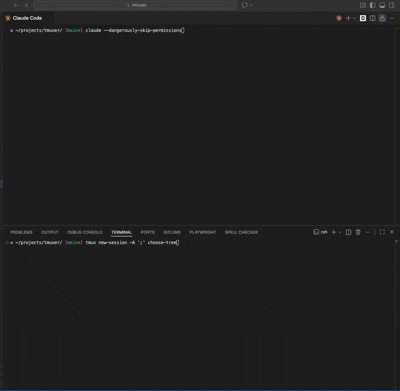

# tmuxer

[](https://www.npmjs.com/package/tmuxer)
[](https://www.npmjs.com/package/tmuxer)

An MCP server for managing background jobs via tmux sessions where you can **watch your LLM's jobs in real-time.**

## Why tmuxer?

When LLM clients run commands, you usually need a few interactions to see the full command, and output is often delayed or truncated. tmuxer gives you:

- **Watch jobs live** - Attach to see command output in real-time as the LLM works
- **Browse all jobs** - Window picker lets you flip between running processes
- **Full terminal support** - Tools like `npm`, `docker`, and `htop` render correctly
- **Interactive input** - Send keystrokes to running jobs (e.g., Ctrl+C to stop, or respond to prompts)
- **Persistent** - Jobs survive across conversation turns; check on them anytime

## Installation

```bash
npm install tmuxer
```

## Usage

Add to your MCP configuration:

```json
{
  "mcpServers": {
    "tmuxer": {
      "command": "npx",
      "args": ["-y", "tmuxer"]
    }
  }
}
```

## MCP Tools

| Tool           | Description                                                                                               |
| -------------- | --------------------------------------------------------------------------------------------------------- |
| `createJob`    | Start a command in a background tmux window                                                               |
| `listJobs`     | List all jobs with status (running, pid, exitCode)                                                        |
| `getJobOutput` | Get terminal output (supports `lastLines` for recent output only)                                         |
| `sendInput`    | Send keystrokes or text to a job (use `{C-c}` for Ctrl+C, `{Up}` for up arrow, `{Enter}` for enter, etc.) |
| `cleanupJobs`  | Remove dead job windows (skips running jobs)                                                              |

## Example workflow

```
1. createJob({ command: "npm run dev", prefix: "dev" })  // returns jobId: "dev1"
2. listJobs()  // check status, pid, running state
3. getJobOutput({ jobId: "dev1", lastLines: 20 })  // see recent logs
4. sendInput({ jobId: "dev1", input: "{C-c}" })  // stop the server
```

## Spectating

Run this in your terminal to attach to (or start) the tmuxer session:

```bash
tmux new-session -A ';' choose-tree
```

You can use the up/down arrow keys to browse running jobs and see their live output in the preview pane. Press `Enter` to select a job and view it full screen.

- `Ctrl+b` then `d` disconnects from tmux
- `Ctrl+b` then `w` Goes back to the picker view.

It may be helpful to brush up on basic tmux commands if you're not familiar with tmux.

# Demos

<details open>
<summary>Observing memory changes in a node process</summary>


</details>

<details open>
<summary>Claude controlling Claude interactively</summary>


</details>

<details open>
<summary>Onboarding and demoing a new app</summary>



</details>


## Nested tmux support

Commands that spawn their own tmux sessions work seamlessly—tmuxer unsets the `TMUX` environment variable so nested sessions work correctly.

## Use cases

- **Dev servers** - Start `npm run dev` and check logs without blocking
- **Builds** - Run `npm run build` and poll for completion
- **Tests** - Run test suites and retrieve results when done
- **Interactive tools** - Handle tools that need input (setup wizards like `npm init`, `create-vite`, `git rebase -i`, etc.)
- **Monitoring** - Check on processes with complex terminal UIs (docker, htop, etc.)

## Development

```bash
npm test        # run tests
npm run build   # compile typescript
```

## License

MIT
