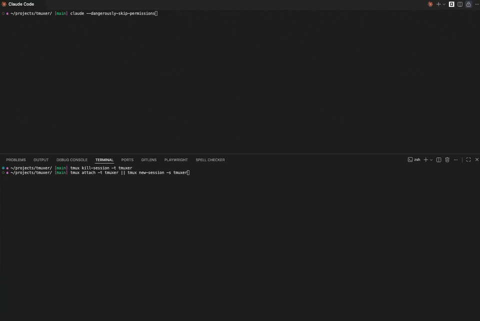

# tmuxer

[](https://www.npmjs.com/package/tmuxer)
[](https://www.npmjs.com/package/tmuxer)

An MCP server for managing background jobs via tmux sessions. **Watch your LLM's jobs in real-time.**

## Why tmuxer?

When LLM clients run commands, you usually need a few interactions to see the full command, and output is often delayed or truncated. tmuxer gives you:

- **Watch jobs live** - Attach to see command output in real-time as the LLM works
- **Browse all jobs** - Window picker lets you flip between running processes
- **Full terminal support** - Tools like `npm`, `docker`, and `htop` render correctly
- **Interactive input** - Send keystrokes to running jobs (e.g., Ctrl+C to stop)
- **Persistent** - Jobs survive across conversation turns; check on them anytime

## Demo



## Installation

```bash
npm install tmuxer
```

## Usage

Add to your MCP configuration:

```json
{
  "mcpServers": {
    "tmuxer": {
      "command": "npx",
      "args": ["-y", "tmuxer"]
    }
  }
}
```

## MCP Tools

| Tool           | Description                                                       |
| -------------- | ----------------------------------------------------------------- |
| `createJob`    | Start a command in a background tmux window                       |
| `listJobs`     | List all active jobs                                              |
| `getJobStatus` | Check if a job is running, get exit code if finished              |
| `getJobOutput` | Get terminal output (supports `lastLines` for recent output only) |
| `sendInput`    | Send keystrokes to a job (use `C-c` for Ctrl+C)                   |
| `killJob`      | Terminate a job and destroy its window                            |

## Example workflow

```
1. createJob({ command: "npm run dev", jobId: "dev-server" })
2. getJobStatus({ jobId: "dev-server" })  // check if running
3. getJobOutput({ jobId: "dev-server", lastLines: 20 })  // see recent logs
4. sendInput({ jobId: "dev-server", input: "C-c" })  // stop the server
5. killJob({ jobId: "dev-server" })  // clean up
```

## Spectating

Run this in your terminal to attach to (or start) the tmuxer session:

```bash
tmux attach -t tmuxer || tmux new-session -s tmuxer
```

When tmuxer is attached, you'll see a **window picker** with a preview pane showing live output:

- `↑`/`↓` - browse jobs and preview their output
- `Enter` - select a job to view full screen
- `Ctrl+B w` - return to the picker from any window
- `Ctrl+B d` - detach (jobs keep running)

New jobs are automatically highlighted when created. You can attach before or after the LLM starts working—the session is created automatically.

## Nested tmux support

Commands that spawn their own tmux sessions (like `newt develop`) work seamlessly—tmuxer unsets the `TMUX` environment variable so nested sessions work correctly.

## Use cases

- **Dev servers** - Start `npm run dev` and check logs without blocking
- **Builds** - Run `npm run build` and poll for completion
- **Tests** - Run test suites and retrieve results when done
- **Interactive tools** - Handle prompts that require user input
- **Monitoring** - Check on processes with complex terminal UIs (docker, htop, etc.)

## Development

```bash
npm test        # run tests
npm run build   # compile typescript
```

## License

MIT
